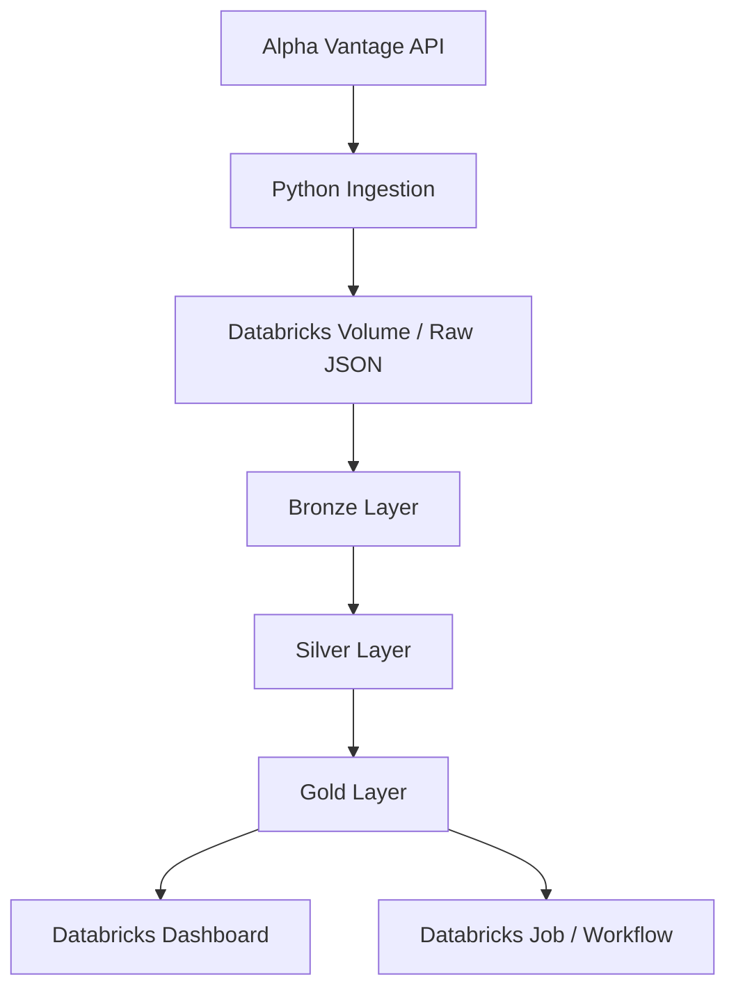

# Crypto Lakehouse Pipeline with Databricks


  


Pipeline completo de Engenharia de Dados para ingestão, transformação, qualidade e análise de dados de criptomoedas utilizando **Python, PySpark, Delta Lake e Databricks**.

Este projeto implementa uma arquitetura **Lakehouse** em camadas (**Bronze / Silver / Gold**) consumindo dados da API da **Alpha Vantage**, salvando arquivos JSON no **Databricks Volume**, processando tudo em **PySpark**, gerando métricas analíticas e exibindo os resultados em um **dashboard no Databricks**.

---

## Objetivo do projeto

Construir um pipeline ponta a ponta de dados para praticar conceitos reais de Engenharia de Dados, incluindo:

- Ingestão de dados via API
- Armazenamento em data lake
- Modelagem em camadas
- Transformações em PySpark
- Data Quality Checks
- Logging estruturado
- Dashboard analítico
- Orquestração via Job ETL

---

## Arquitetura do projeto



---

## Tecnologias utilizadas

- Python
- PySpark
- Spark SQL
- Databricks
- Delta Lake
- REST API
- JSON
- Databricks Volumes
- Databricks Jobs
- Databricks SQL Dashboard
- Git / GitHub

---

## Estrutura do projeto

```
crypto-lakehouse-pipeline/
│
├── src/
│   ├── ingestion/
│   │   ├── config.py
│   │   └── ingest_crypto.py
│   │
│   ├── transformations/
│   │   ├── bronze.py
│   │   └── ingest_crypto.py
│   │   └── gold.py
│   │
│   ├── data_quality/
│   │   ├── silver_checks.py
│   │   └── gold_checks.py
│   │
│   └── utils/
│       └── logger.py
│
├── .gitignore
└── README.md
```

---

## Fluxo do pipeline

### 1. Ingestão
Consumo da API Alpha Vantage

Extração diária de múltiplas criptomoedas:
- BTC
- ETH
- SOL
- ADA
- XRP
- BNB
- DOT
- DOGE
- TRX
- LTC

Salvamento dos dados em formato JSON no Databricks Volume

### 2. Bronze Layer
- Leitura dos arquivos RAW
- Padronização inicial
- Armazenamento da camada bruta em tabela Delta

### 3. Silver Layer
- Tratamento e tipagem de colunas
- Deduplicação dos dados
- Aplicação de regras de negócio
- MERGE incremental em Delta

### 4. Gold Layer
Criação de métricas analíticas, como:
- price_today
- price_yesterday
- perc_change
- spread
- spread_pct
- price_rank

### 5. Dashboard
Visualizações construídas diretamente no Databricks SQL

Análise de:
- Ranking por preço
- Variação diária
- Spread percentual
- Comparação financeira das criptomoedas

### 6. Orquestração
Criação de Job ETL no Databricks

Execução automatizada das etapas:
- Ingestão
- Bronze
- Silver
- Gold
- Atualização do Dashboard

---

## Data Quality Checks

O pipeline inclui validações para garantir integridade dos dados.

Exemplos de checks:
- exchange_rate precisa ser positivo 
- crypto_code não pode ser nulo
- spread não pode ser negativo
- perc_change não pode ser nulo (quando aplicável)

Essas validações foram implementadas em módulos dedicados de data quality para as camadas Silver e Gold.

---

## Logging

O projeto também conta com logging estruturado para rastrear a execução do pipeline.

Exemplos de eventos monitorados:
- Início e fim da ingestão
- Criptomoeda em processamento
- Arquivos salvos
- Início/fim das transformações Bronze / Silver / Gold
- Falhas de qualidade de dados
- Erros de API

---

## Métricas criadas na camada Gold

Algumas métricas analíticas implementadas:
- Preço atual
- Preço do dia anterior
- Variação percentual diária
- Spread absoluto
- Spread percentual
- Ranking por preço

Essas métricas foram usadas para alimentar o dashboard analítico.

---

## Principais aprendizados

Este projeto foi construído para consolidar conhecimentos práticos em:
- Engenharia de Dados
- Arquitetura Lakehouse
- PySpark
- Delta Lake
- Modelagem da arquitetura medalhão
- Data Quality
- Logging
- ETL / ELT
- Databricks Workflows
- Dashboards analíticos
